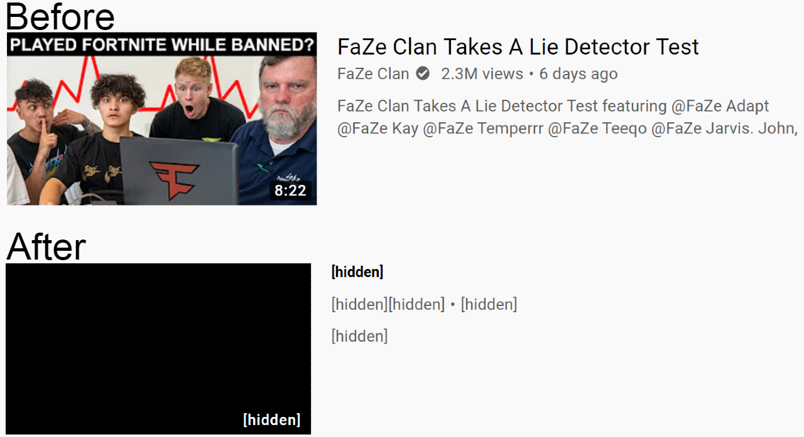

# YoutubeThumbnailFaceAvoider
**Google Chrome extension for YouTube that hides video thumbnails that have a dramatic face**

### Important References

This extension implements the face-api JavaScript face recognition API which can be found [here.](https://github.com/justadudewhohacks/face-api.js/)  
This extension also implements the cors-anywhere NodeJS proxy which can be found [here.](https://github.com/Rob--W/cors-anywhere)

### Motivation

As someone who frequently browses YouTube, I am often annoyed by the clickbait thumbnails that plague so much of the popular content. This is what motivated me to make an application that would remove these thumbnails so I wouldn't have to look at them. Although this application would likely not be practical, I saw this as an oppurtunity to broaden my CS knowledge and skillset.

### How to Use Extension

Since the extension is not published on the Chrome Web Store, you will need to clone this repository to use it. Once the repository has been cloned, navigate to the chrome://extensions webpage. Enable developer mode (top right corner of webpage). Click on the "Load unpacked" button and navigate to the repository's directory. Enable the extension. Now you should see the extension's icon in the top right of the browser. When you go to YouTube, the icon should appear in color, meaning that it is usable. Keep in mind that the extension will not work on certain YouTube webpages such as a playlist webpage or a video's webpage. Enjoy!  

## The Development Process

### Initial Design Idea

Here is how I initially planned for the application to work:

1. The application would access a user's subscription feed and home page.
2. The application would iterate over all of the videos on the respective page.
3. For each video, the application would determine whether there is a dramatic face in the video's thumbnail (dramatic faces are common in clickbait thumbnails).
4. If there is a dramatic face in the video's thumbnail, then the application would remove that video from the page.

### First Approach

My first approach on creating the application was to use Python, a coding language that I had worked with recently. I knew that Python was widely supported by APIs such as YouTube's Data API. Unfortunately, this API could not efficently help me create the application that I had envisioned. The API did not provide a direct way to access my YouTube subscription feed. The fastest way of doing so was to get the list of channels that I was subscribed to, then iterate over that list and find the most recent video from each channel. This required many requests to the API which led to extremely slow performance. I had to find a new approach.

### The Final Approach

The next and final approach was creating the application using JavaScript. When researching for face detection APIs, one of the most popular results was face-api, a "JavaScript face recognition API for the browser and nodejs implemented on top of tensorflow.js core" created by [justadudewhohacks](https://github.com/justadudewhohacks). It had been many years since I had written anything in JavaScript, but I decided to give it a go. I found out that making a Google Chrome extension would be the best way to accomplish my goal since the extension could use JavaScript as well as access the current webpage.  
  
The first hurdle I faced was implementing face-api. Google Chrome extensions contain content scripts which can access the current webpage's HTML code. However, these content scripts live in their own isolated worlds, meaning that they can not access other files. face-api includes a models folder which contains neccessary files that are not written in JavaScript. This means that the content page has no way to access them. The solution to this problem was implenting face-api in the popup.js file which was not a content script. The popup.js file brings functionality to the extension's button at the top right corner of the browser.  
This is how the extension works:  
  * popup.js sends a message to content.js informing the script that it should iterate over all of the videos on the webpage
  * content.js responds to popup.js with an array of all of the video objects (each object includes the video title and thumbnail)
  * popup.js iterates over the video objects and determines which videos have a dramatic face in their respective thumbnail
  * popup.js sends a message to content.js including all of the video objects that should be removed
  * content.js iterates over all of the videos again and removes the videos that were provided by popup.js
  
The second hurdle I faced was retrieving each video thumbnail from its URL. I learned that there exists a security policy called CORS which exists on many webpages. CORS stands for Cross-Origin Resource Sharing. It determines whether a specified webpage can share resources with a domain that is different from its origin. In my case, the browser was trying to retrieve an image from a different origin. This action is blocked on many pages. The CORS security policy only applies to browser-to-server communication, not server-to-server communication. I learned about this in [this article.](https://medium.com/@dtkatz/3-ways-to-fix-the-cors-error-and-how-access-control-allow-origin-works-d97d55946d9). So, I needed to create a proxy server which would relay my request for the image. The proxy server would be able to access the image's webpage's resources since it is a server. I created a JavaScript file implementing [Rob--W's cors-anywhere](https://github.com/Rob--W/cors-anywhere) proxy server code and hosted the server on [Heroku.com.](https://heroku.com) 

## Final Thoughts

Overall, I am happy with how the extension turned out. The extension does have its faults. For instance, sometimes a video that I would want to watch or that I wouldn't consider to be clickbait, is removed. Also videos are never actually "removed" from the webpage. I discovered that if I actually deleted the HTML element associated with the video, then the video would reappear if I scrolled down (to load more videos) and scrolled back up. Instead of removing the video, I hide all information about the video. Another fault is that the extension can take a while (at least a few seconds) to hide videos especially when the computer doesn't have great hardware. Despite these faults, I am very satisfied with how it turned out, especially since I was learning throughout the whole process. 
